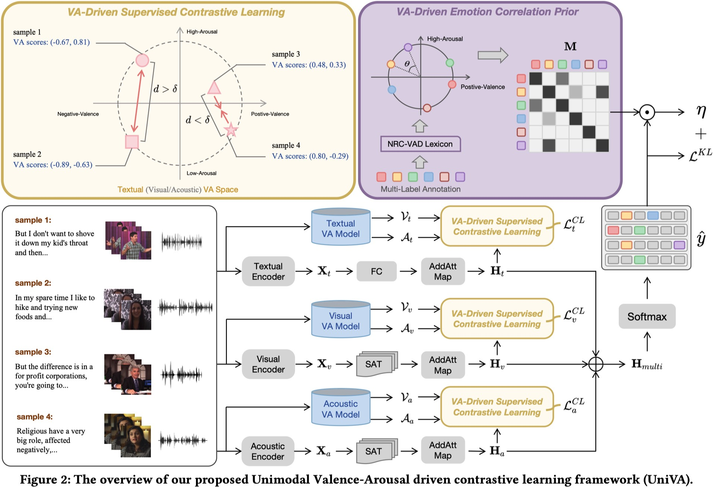

## A Unimodal Valence-Arousal Driven Contrastive Learning Framework for Multimodal Multi-Label Emotion Recognition

<i>Wenjie Zheng, Jianfei Yu, and Rui Xia</i>

<a href=" "></a>
[](https://2024.acmmm.org/)
</div>

📄 [Paper](https://dl.acm.org/doi/10.1145/3664647.3681638) 📽️ [Slides](Oct29.2024.oral.pdf)

This repository contains the code for UniVA, a framework that proposes unimodal valence-arousal driven contrastive learning for the multimodal multi-label emotion recognition task.




### Dependencies

```
conda env create -f environment.yml
```
***

### Data preparation

[Download link](https://pan.baidu.com/s/1UMCAq2Yu-RLV0t-w0-08hg?pwd=xedi). Also, there are two files that, due to upload size limitations, have been placed at the [link](https://huggingface.co/NUSTM/UniVA/tree/main).
***

### Evaluating UniVA on the MOSEI dataset
you can check our UniVA-RoBERTa on 4 NVIDIA 3090 GPUs by running the script below
```
nohup bash run_MOSEI/run_MOSEI_TAV_ours.sh &
```
you can get the following results: Acc`51.3` HL`0.182` miF1`60.5` maF1`44.4`

To evaluate the performance of UniVA-Glove on 1 NVIDIA 3090Ti GPU, run the script below
```
nohup bash run_MOSEI/run_MOSEI_TAV_ours_glove.sh &
```
you can get the following results: Acc`49.2` HL`0.205` miF1`57.2` maF1`37.2`

### Evaluating UniVA on the M3ED dataset
you can check our UniVA-RoBERTa on 4 NVIDIA 3090 GPUs by running the script below
```
nohup bash run_M3ED/run_M3ED_TAV_ours.sh &
```
you can get the following results: Acc`50.6` HL`0.149` miF1`53.4` maF1`40.2`

To evaluate the performance of UniVA-Glove on 1 NVIDIA 3090Ti GPU, run the script below
```
nohup bash run_M3ED/run_M3ED_TAV_ours_glove.sh &
```
you can get the following results: Acc`46.4` HL`0.159` miF1`49.1` maF1`24.2`

***

### Citation

Please consider citing the following if this repo is helpful to your research.
```
@inproceedings{zheng2024univa,
  title={A Unimodal Valence-Arousal Driven Contrastive Learning Framework for Multimodal Multi-Label Emotion Recognition},
  author={Zheng, Wenjie and Yu, Jianfei and Xia, Rui},
  booktitle={Proceedings of the 32st ACM International Conference on Multimedia},
  year={2024}
}
```

Please let me know if I can future improve in this repositories or there is anything wrong in our work. You can ask questions via `issues` in Github or contact me via email wjzheng@njust.edu.cn. Thanks for your support!


